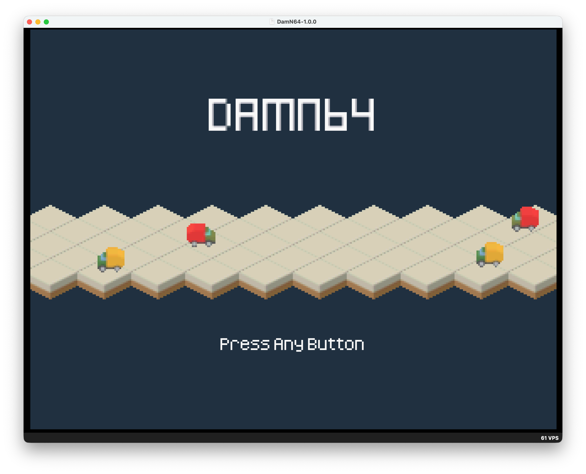
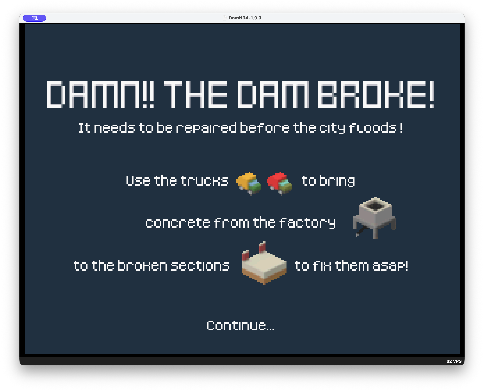
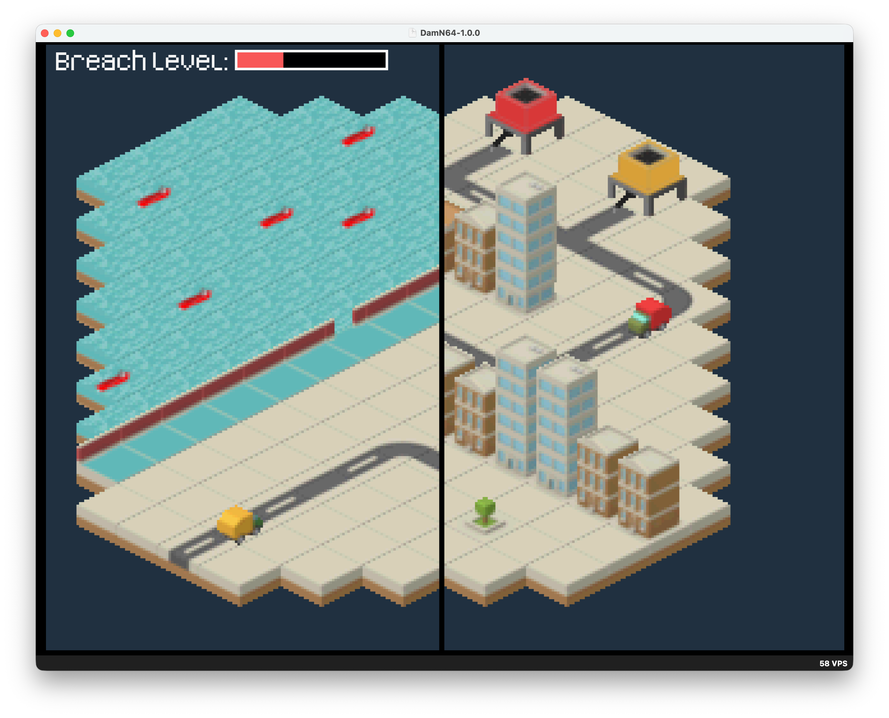
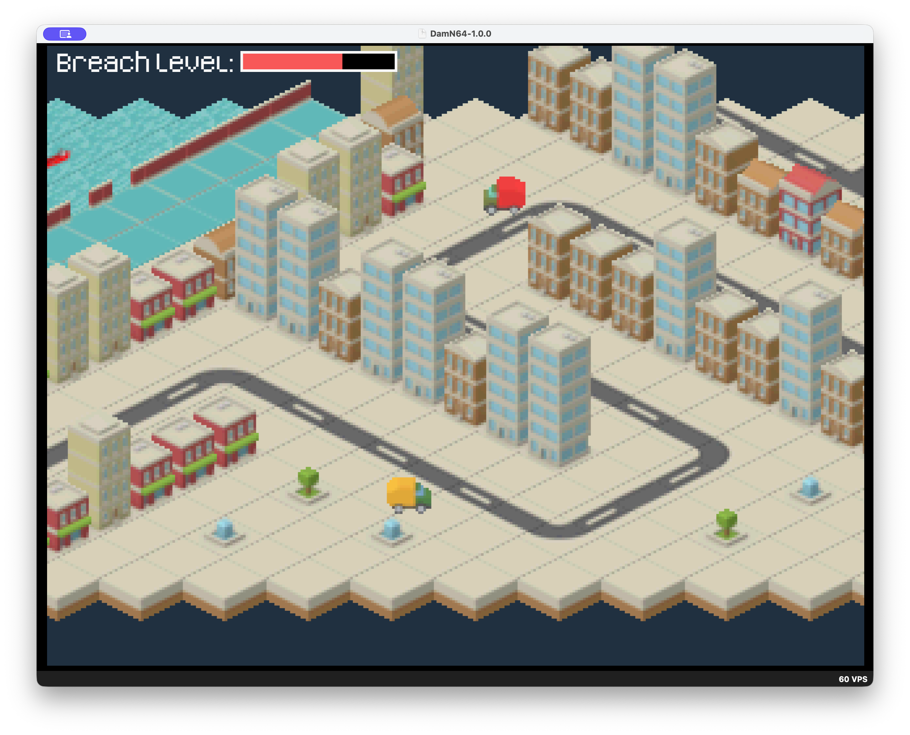

DamN64
======

Damn! The dam broke and needs to be repaired before the city floods!
Isometric two-vehicle N64 sandbox built for n64brew jam #6.

About
-----

DamN64 is a libdragon-powered Nintendo 64 game with an isometric map and two driveable vehicles. It supports a horizontal split-screen view when players move far enough apart, and merges back to a single view when they are close.

Screenshots
-----------






Controls
--------

| Button | Action |
| --- | --- |
| D-Pad / Stick | Move your vehicle |
| Z (single player) | Switch active vehicle |

With two controllers connected, each player controls a vehicle.

Build and Run
-------------

Build uses Docker for cross-compilation when available.

```bash
make build
```

Other useful targets:

```bash
make rebuild
make clean
make ares
```

Project Structure
-----------------

```
src/         C source files
include/     Header files
resources/   Source assets (sprites, audio)
filesystem/  Generated assets (gitignored)
build/       Build artifacts (gitignored)
```

Notes
-----

- ROM output: `DamN64.z64`
- Build artifacts and generated assets are gitignored.
- FPS counter is shown only in debug builds.


Thanks
------

* Thanks to [Kenney](https://www.kenney.nl) for the art used in the game.
* Thanks to [The libdragon maintainers](https://github.com/DragonMinded/libdragon/graphs/contributors) for libdragon.
